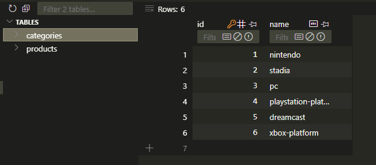
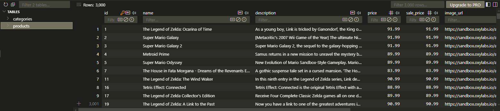
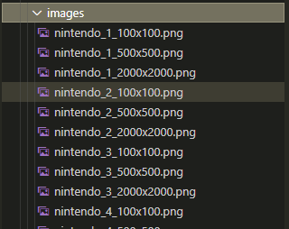

  
# Extract data Test Exercise

## 🌲 Project tree

```
📂 app
|
├── 📂 core                    # Module with helper functions
│   ├── 📜 constants.py        # Global constants definitions
│   ├── 📜 csv_helper.py       # Functions for handling CSV files
│   ├── 📜 db_helper.py        # Functions for handling Database 
│   ├── 📜 img_helper.py       # Functions for image processing
│   └── 📜 scrapper_helper.py  # Functions for the scraper
├── 📂 database                # Database module
│   ├── 📂 config              # Database configuration
│   │   └── 📜 base.py         # Declarative Base configuration for database
│   ├── 📂 models              # Data models definitions
│   │   ├── 📜 category.py     # Category model
│   │   └── 📜 product.py      # Product model
│   └── 📜 db.py               # Database connection management
├── 📂 output                  # Output directory for processed data
│   ├── 📂 images              # Processed images
│   ├── 📄 data.csv            # Processed CSV file with extracted data
│   └── 📄 products.db         # Database storing product data
├── 📂 scrapper                # Web scraper module
│   ├── 📜 processor.py        # Processor for web pages
│   └── 📜 spider.py           # Spider definition for web scraping
├── 📜 main.py                 # Main entry point of the system
├── 📄 requirements.txt        # Python dependencies
├── 📜 runners.py              # Scripts for executing main tasks
├── 📄 scrapy.cfg              # Scrapy configuration file
└── 📜 settings.py             # Scrapy project settings
```

## 🛠️ Workflow

The workflow of the app is divided into small steps.
- Cleaning of previous files to avoid problems in successive executions.
- Database creation with the corresponding models.
- Main data extraction process.
- Image processing and resizing process.
- Data extraction process to a CSV file.


Extraction process uses 🕷️ Scrapy Framework, a Python framework used for web scraping, it allows to extract, process, and store data from websites efficiently.

## 📝 Notes before run

- The ```run_image_processing()``` function may increase execution time, as it downloads and processes images after data extraction. For quick testing, it is recommended to temporarily disable it in ```main.py```.


## 🚀Run the project

There are two alternatives for executing the project, and the choice depends on the needs of the execution environment.


### 1️⃣ Running in a virtual environment (Linux)

***Requirements***:``` Python```

#### Steps

Install virtualenv (if you don't have it installed):

```
pip install venv
```
Create a virtual environment in the directory where the project is located.

```
venv env
```
This will create a directory named venv that contains an isolated Python installation.

Activate the virtual environment

```
. ./env/bin/activate
```

Go to app folder
```
cd app
```

Once the virtual environment is activated, you must install the necessary dependencies for the project.

```
pip install -r requirements.txt
```

With the virtual environment active and the dependencies installed, you canrun the project normally. 

```
python main.py
```

When you have finished working on the project, you must deactivate the virtual environment

```
deactivate
```

### 2️⃣ Running in a Docker-Compose (Linux/Windows)

***Requirements***: ```Docker``` and ```Docker Compose```

An alternative option is to run the project using Docker Compose. Especially useful if you have compatibility issues with the environment (such as on Windows systems).


#### Steps

If you do not have Docker and Docker Compose installed, you will need to install it first.

Build and run the container with Docker Compose.

```
docker-compose up --build -d
```

```--build```: Forces the image to rebuild if there are changes in the Dockerfile or project files.

```-d```: Stands for “detached mode”, which allows a container to run in the background.

The container should run the project as defined in the Dockerfile. The project should start automatically.
The process logs will be printed in the console.
The results (Data Base, CSV, Images) will be saved in `/app/output`.

#### 🔄 Restart the Process in the Container 

To run the process again on a running container, an interactive session with the container must be started.

```
docker exec -it astrea-test bash
```

Then just run the main python script.

```
python3 main.py
```

#### 🛑 Stop the container

Stop the container after completion of the tests

```
docker compose down
```
 
## ✅ Results

After execution, the database and the resulting CSV file contain 2,950 categorized products and 50 unavailable ones. These unavailable products do not appear in the main categories but are listed separately under "All Products."

As a result, data for 3,000 products is extracted into the database, along with 6 categories representing console names and an additional category for products that could not be categorized.

Additionally, 3,000 images are processed in 3 different sizes, totaling 9,000 images.

Finally, the database data is exported to a CSV file, sorted by category, price (from highest to lowest), and name.


### Categories



### Products



### Images




